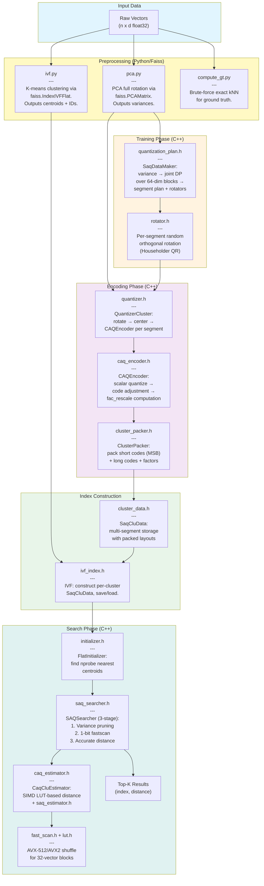
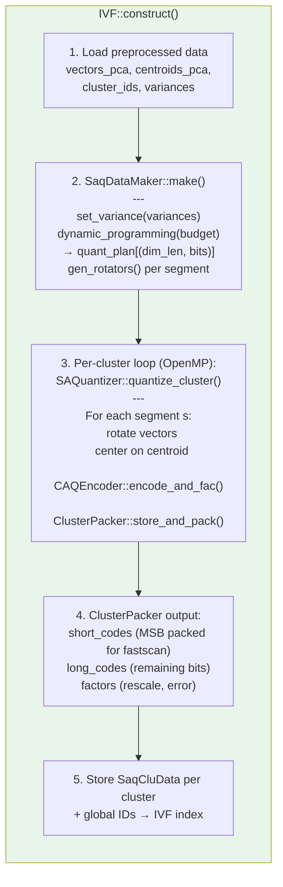
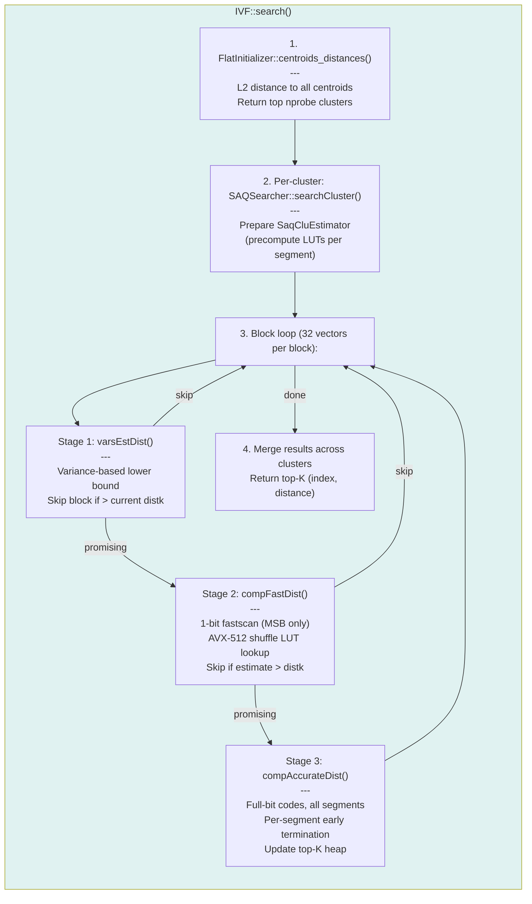
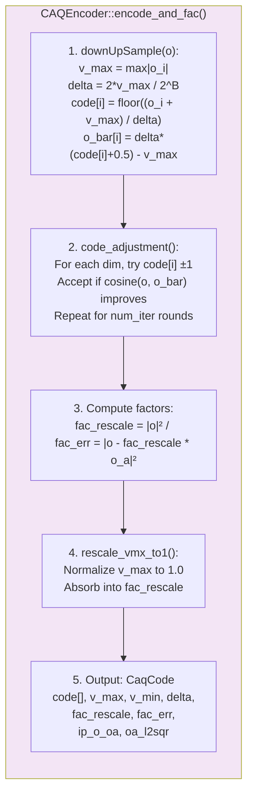

# SAQ Codeflow Diagrams

## 1. High-Level File Architecture

This diagram shows the flow between major components from data input to search results.



## 2. Detailed Function-Level Flow

### Index Construction: `IVF::construct()`



### Search: `IVF::search()`



### CAQEncoder: `encode_and_fac()`



## Legend

| Phase | Description |
|-------|-------------|
| **Preprocessing** | PCA rotation, K-means clustering, ground truth (Python/Faiss) |
| **Training** | Joint DP segmentation + bit allocation, per-segment rotation matrices |
| **Encoding** | Per-cluster: rotate -> CAQ encode -> pack short/long codes |
| **Indexing** | Build IVF with SaqCluData per cluster |
| **Search** | 3-stage block-level search: variance pruning -> 1-bit fastscan -> accurate |

## Key Data Structures

```
SaqData (quantization plan)
├── QuantizeConfig          # bpd, dist_type, use_caq, etc.
├── quant_plan[]            # [(dim_len, bits)] per segment
├── BaseQuantizerData[]     # Per-segment: rotator, centroid, metadata
└── data_variance           # Per-dimension variance from PCA

SaqCluData (per-cluster storage)
├── CAQClusterData[]        # Per-segment:
│   ├── short_codes         # MSB-packed for fastscan (32-vector blocks)
│   ├── long_codes          # Remaining bits
│   ├── factors             # fac_rescale, fac_err per vector
│   └── metadata            # v_max, v_min, delta per vector
├── global_ids[]            # Original vector indices
└── num_vectors

IVF (inverted file index)
├── FlatInitializer         # Centroid storage for nprobe selection
├── SaqData                 # Shared quantization plan
├── SaqCluData[]            # Per-cluster encoded data
└── SearcherConfig          # nprobe, num_rerank, etc.
```

## Source Files

| File | Key Classes | Purpose |
|------|-------------|---------|
| `quantization_plan.h/.cpp` | SaqData, SaqDataMaker | DP segmentation, bit allocation, serialization |
| `caq_encoder.h/.cpp` | CAQEncoder, CaqCode | Scalar quantize + code adjustment + factors |
| `quantizer.h/.cpp` | QuantizerCluster, QuantizerSingle | Per-segment encode orchestration |
| `saq_quantizer.h/.cpp` | SAQuantizer, SAQuantizerSingle | Multi-segment cluster orchestration |
| `caq_estimator.h/.cpp` | CaqCluEstimator | 3-stage SIMD distance (variance, fastscan, accurate) |
| `saq_estimator.h/.cpp` | SaqCluEstimator | Multi-segment distance aggregation |
| `saq_searcher.h/.cpp` | SAQSearcher | Block-level 3-stage search with early termination |
| `cluster_data.h/.cpp` | CAQClusterData, SaqCluData | Per-segment and multi-segment cluster storage |
| `cluster_packer.h/.cpp` | ClusterPacker | Pack codes + factors into cluster format |
| `fast_scan.h/.cpp` | — | AVX-512/AVX2 LUT-based fastscan primitives |
| `lut.h/.cpp` | Lut | High-accuracy fast IP via lookup tables |
| `ivf_index.h/.cpp` | IVF | Index construct, search, save/load |
| `rotator.h/.cpp` | Rotator, PCARotator | Random orthogonal rotation (Householder QR) |
