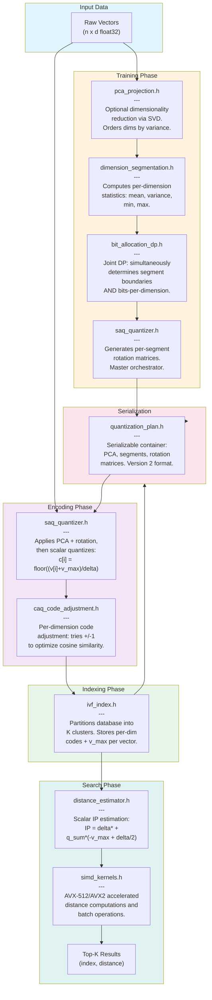

# SAQ Codeflow Diagrams

## 1. High-Level File Architecture

This diagram shows the flow between major components/files from data input to search results.



## 2. Detailed Function-Level Flow

This diagram shows the detailed function calls from training through search.

```mermaid
flowchart TB
    subgraph TrainFlow["SAQQuantizer::Train()"]
        direction TB
        T1["1. Validate input<br/>(n_vectors, dim, config)"]

        T2["2. PCAProjection::Train()<br/>---<br/>Compute mean vector<br/>Build covariance matrix<br/>SVD decomposition<br/>Extract top-k eigenvectors"]

        T3["3. PCAProjection::ProjectBatch()<br/>---<br/>Center data (subtract mean)<br/>Matrix multiply: X x W^T<br/>Output: reduced dims"]

        T4["4. DimensionSegmenter::ComputeStats()<br/>---<br/>Welford's online variance<br/>Per-dimension mean, var, min, max"]

        T5["5. BitAllocatorDP::AllocateJoint()<br/>---<br/>Joint DP over (dim, bits_used)<br/>Tries all segment lengths + bit widths<br/>Distortion: (1/2^B*pi) * sum(sigma_i^2)<br/>Backtrack optimal segments + allocation"]

        T6["6. GenerateRotations()<br/>---<br/>Random orthonormal matrix per segment<br/>Gram-Schmidt orthogonalization<br/>Store in QuantizationPlan"]

        T1 --> T2
        T2 --> T3
        T3 --> T4
        T4 --> T5
        T5 --> T6
    end

    subgraph EncodeFlow["SAQQuantizer::EncodeBatch()"]
        direction TB
        E1["1. Project vectors (if PCA)<br/>PCAProjection::ProjectBatch()"]

        E2["2. Apply per-segment rotation<br/>---<br/>Multiply by rotation matrix R_s<br/>per segment to decorrelate dims"]

        E3["3. Scalar quantize per dimension<br/>---<br/>v_max = max|rotated[i]|<br/>delta = 2*v_max / 2^B<br/>code[i] = floor((v[i] + v_max) / delta)<br/>Store codes[] + v_max"]

        E4["4. CAQAdjuster::Refine() (optional)<br/>---<br/>For each dimension: try c[i]+/-1<br/>Accept if cosine similarity improves<br/>Repeat for num_rounds"]

        E1 --> E2
        E2 --> E3
        E3 --> E4
    end

    subgraph IVFBuild["IVFIndex::Build()"]
        direction TB
        I1["1. Store centroids in<br/>FlatInitializer or HNSWInitializer"]

        I2["2. Group vectors by cluster<br/>---<br/>Use pre-computed assignments<br/>Store global_ids per cluster"]

        I3["3. Train SAQQuantizer on all data<br/>---<br/>Joint DP + rotation matrices<br/>Shared quantizer across clusters"]

        I4["4. Encode vectors per cluster<br/>---<br/>SAQQuantizer::EncodeBatch()<br/>Store codes[], v_maxs[], norms_sq[]<br/>(OpenMP parallel over vectors)"]

        I1 --> I2
        I2 --> I3
        I3 --> I4
    end

    subgraph SearchFlow["IVFIndex::Search()"]
        direction TB
        S1["1. FindNearestClusters()<br/>---<br/>Compute query-centroid distances<br/>Return top nprobe clusters"]

        S2["2. TransformQuery()<br/>---<br/>Apply PCA + per-segment rotation<br/>Compute query_norm_sq = ||q||^2"]

        S3["3. PrecomputeScalarQuery()<br/>---<br/>Per-segment: q_sum, scale factor<br/>Store rotated query for dot products"]

        S4["4. ScanClusterScalar()<br/>---<br/>For each vector in cluster:<br/>  IP = delta * <codes, q> + bias<br/>  dist = ||q||^2 - 2*IP + ||o||^2<br/>  Heap insert if dist < worst"]

        S5["5. Merge results from all clusters<br/>---<br/>Sort heap by distance<br/>Return top-K (index, distance)"]

        S1 --> S2
        S2 --> S3
        S3 --> S4
        S4 --> S5
    end

    subgraph SIMD["simd_kernels.h"]
        direction LR
        K1["L2Distance()"]
        K2["L2DistancesBatch()"]
        K3["InnerProductBatch()"]
    end

    TrainFlow --> EncodeFlow
    EncodeFlow --> IVFBuild
    IVFBuild --> SearchFlow
    SearchFlow -.->|"uses"| SIMD

    style TrainFlow fill:#fff3e0
    style EncodeFlow fill:#f3e5f5
    style IVFBuild fill:#e8f5e9
    style SearchFlow fill:#e0f2f1
    style SIMD fill:#ffebee
```



## Legend

| Phase | Description |
|-------|-------------|
| **Training** | Learn PCA, joint segmentation + bit allocation (DP), and rotation matrices from sample data |
| **Encoding** | Compress vectors using per-dimension scalar quantization with optional CAQ refinement |
| **Indexing** | Build IVF partitions and encode all vectors with shared quantizer |
| **Search** | Find approximate nearest neighbors using scalar IP estimation with L2 conversion |

## Key Data Structures

```
QuantizationPlan (version 2)
├── PCAParams            # Mean, components for projection
├── Segment[]            # Dimension ranges + bits per segment
├── SegmentRotation[]    # Per-segment orthonormal rotation matrices
└── Codebook[] (legacy)  # K-means centroids (version 1 only)

ScalarEncodedVector
├── codes: uint8[]       # Per-dimension quantized codes
└── v_max: float         # Per-vector max absolute value

IVFIndex
├── CentroidInitializer  # Flat or HNSW for cluster lookup
├── Cluster[]
│   ├── global_ids[]     # Original vector indices
│   ├── codes[]          # Per-dimension scalar codes (num_vectors x working_dim)
│   ├── v_maxs[]         # Per-vector v_max scaling factors
│   └── norms_sq[]       # Per-vector ||o||^2 for L2 distance
├── SAQQuantizer         # Shared quantizer (trained on all data)
└── DistanceEstimator    # Scalar IP estimation engine
```

## OpenMP Parallelization

The following operations are parallelized when `SAQ_USE_OPENMP=1`:

| Operation | File | Strategy |
|-----------|------|----------|
| `EncodeBatch()` | saq_quantizer.cpp | `parallel for schedule(dynamic)` over vectors |
| `SearchBatch()` | ivf_index.cpp | `parallel for schedule(dynamic)` over queries |
| `Build()` encoding | ivf_index.cpp | `parallel for schedule(dynamic)` over vectors |
| `ProjectBatch()` | pca_projection.cpp | `parallel for schedule(static)` over vectors |
| `ComputeCovariance()` | pca_projection.cpp | `parallel for schedule(dynamic)` (triangular) |
| `ComputeStats()` | dimension_segmentation.cpp | `parallel for schedule(static)` with thread-local accumulators |
| `EstimateScalarIPBatch()` | distance_estimator.cpp | `parallel for schedule(static)` over vectors |

## Python Bindings

The `python/saq/` package wraps the C++ API via pybind11:

```python
import saq

# Build index
index = saq.IVFIndex()
config = saq.IVFTrainConfig()
config.ivf.num_clusters = 1024
config.saq.total_bits = 64
index.build(data, centroids, assignments, config)

# Search (GIL released during C++ computation)
indices, distances = index.search_batch(queries, k=10, nprobe=32)
```
