# SAQ Codeflow Diagrams

## 1. High-Level File Architecture

This diagram shows the flow between major components/files from data input to search results.

```mermaid
flowchart TB
    subgraph Input["📥 Input Data"]
        RAW["Raw Vectors<br/>(n × d float32)"]
    end

    subgraph Training["🎓 Training Phase"]
        PCA["pca_projection.h<br/>━━━━━━━━━━━━━━━━━━━<br/>Optional dimensionality<br/>reduction via SVD.<br/>Orders dims by variance."]
        
        SEG["dimension_segmentation.h<br/>━━━━━━━━━━━━━━━━━━━<br/>Partitions dimensions into<br/>contiguous segments based<br/>on variance statistics."]
        
        BIT["bit_allocation_dp.h<br/>━━━━━━━━━━━━━━━━━━━<br/>Dynamic programming to<br/>optimally distribute bits<br/>across segments (rate-distortion)."]
        
        SAQ["saq_quantizer.h<br/>━━━━━━━━━━━━━━━━━━━<br/>Trains k-means codebooks<br/>per segment. Master<br/>orchestrator for training."]
    end

    subgraph Encoding["💾 Encoding Phase"]
        ENC["saq_quantizer.h<br/>━━━━━━━━━━━━━━━━━━━<br/>Encodes vectors to codes<br/>via nearest centroid lookup."]
        
        CAQ["caq_code_adjustment.h<br/>━━━━━━━━━━━━━━━━━━━<br/>Cross-segment code<br/>refinement to minimize<br/>total reconstruction error."]
    end

    subgraph Indexing["📇 Indexing Phase"]
        IVF["ivf_index.h<br/>━━━━━━━━━━━━━━━━━━━<br/>Partitions database into<br/>K clusters. Enables<br/>sublinear search (nprobe)."]
        
        FS["fast_scan.h<br/>━━━━━━━━━━━━━━━━━━━<br/>Packs codes into SIMD-<br/>friendly blocked layout<br/>for accelerated scanning."]
    end

    subgraph Storage["💿 Serialization"]
        PLAN["quantization_plan.h<br/>━━━━━━━━━━━━━━━━━━━<br/>Serializable container for<br/>all trained parameters:<br/>PCA, segments, codebooks."]
    end

    subgraph Search["🔍 Search Phase"]
        DIST["distance_estimator.h<br/>━━━━━━━━━━━━━━━━━━━<br/>Precomputes query-to-<br/>centroid distance tables<br/>for asymmetric search."]
        
        SIMD["simd_kernels.h<br/>━━━━━━━━━━━━━━━━━━━<br/>AVX-512/AVX2 accelerated<br/>distance computations and<br/>batch operations."]
        
        RESULT["Top-K Results<br/>(index, distance)"]
    end

    RAW --> PCA
    PCA --> SEG
    SEG --> BIT
    BIT --> SAQ
    SAQ --> PLAN
    
    RAW --> ENC
    PLAN --> ENC
    ENC --> CAQ
    CAQ --> IVF
    
    IVF --> FS
    FS --> Storage
    PLAN --> Storage
    
    IVF --> DIST
    DIST --> SIMD
    SIMD --> RESULT

    style Input fill:#e1f5fe
    style Training fill:#fff3e0
    style Encoding fill:#f3e5f5
    style Indexing fill:#e8f5e9
    style Storage fill:#fce4ec
    style Search fill:#e0f2f1
```



## 2. Detailed Function-Level Flow

This diagram shows the detailed function calls from training through search.

```mermaid
flowchart TB
    subgraph TrainFlow["🎓 SAQQuantizer::Train()"]
        direction TB
        T1["1. Validate input<br/>(n_vectors, dim, config)"]
        
        T2["2. PCAProjection::Train()<br/>━━━━━━━━━━━━━━━━━━━<br/>• Compute mean vector<br/>• Build covariance matrix<br/>• SVD decomposition<br/>• Extract top-k eigenvectors"]
        
        T3["3. PCAProjection::ProjectBatch()<br/>━━━━━━━━━━━━━━━━━━━<br/>• Center data (subtract mean)<br/>• Matrix multiply: X × Wᵀ<br/>• Output: reduced dims"]
        
        T4["4. DimensionSegmenter::ComputeStats()<br/>━━━━━━━━━━━━━━━━━━━<br/>• Welford's online variance<br/>• Per-dimension mean, var, min, max"]
        
        T5["5. DimensionSegmenter::Segment()<br/>━━━━━━━━━━━━━━━━━━━<br/>• Group dims by variance<br/>• Create contiguous segments<br/>• Compute segment variances"]
        
        T6["6. BitAllocatorDP::Allocate()<br/>━━━━━━━━━━━━━━━━━━━<br/>• DP over (segment, bits_used)<br/>• Distortion: σ² × 2⁻²ᵇ<br/>• Backtrack optimal allocation"]
        
        T7["7. TrainCodebooks() per segment<br/>━━━━━━━━━━━━━━━━━━━<br/>• Extract segment dimensions<br/>• K-means++: init centroids<br/>• Lloyd iterations<br/>• Store codebook in plan"]
        
        T1 --> T2
        T2 --> T3
        T3 --> T4
        T4 --> T5
        T5 --> T6
        T6 --> T7
    end

    subgraph EncodeFlow["💾 SAQQuantizer::EncodeBatch()"]
        direction TB
        E1["1. Project vectors (if PCA)<br/>PCAProjection::ProjectBatch()"]
        
        E2["2. For each segment s:<br/>━━━━━━━━━━━━━━━━━━━<br/>• Extract dims[s.start : s.end]<br/>• Find nearest centroid<br/>• codes[s] = argmin distance"]
        
        E3["3. CAQRefine::Refine() (optional)<br/>━━━━━━━━━━━━━━━━━━━<br/>• Compute residual error<br/>• Greedy code adjustment<br/>• Minimize ||x - Σ codebook[s][c[s]]||²"]
        
        E1 --> E2
        E2 --> E3
    end

    subgraph IVFBuild["📇 IVFIndex::Build()"]
        direction TB
        I1["1. Store centroids in<br/>FlatInitializer or HNSWInitializer"]
        
        I2["2. Assign vectors to clusters<br/>━━━━━━━━━━━━━━━━━━━<br/>• For each vector:<br/>  - FindNearestCluster()<br/>  - Store global_id in cluster"]
        
        I3["3. Per-cluster SAQ training<br/>━━━━━━━━━━━━━━━━━━━<br/>• Extract cluster residuals<br/>• SAQQuantizer::Train()<br/>• SAQQuantizer::EncodeBatch()"]
        
        I4["4. PackCodes4bit() / PackCodes8bit()<br/>━━━━━━━━━━━━━━━━━━━<br/>• Reorganize to blocked layout<br/>• 32 vectors per block<br/>• Interleave for SIMD access"]
        
        I1 --> I2
        I2 --> I3
        I3 --> I4
    end

    subgraph SearchFlow["🔍 IVFIndex::Search()"]
        direction TB
        S1["1. FindNearestClusters()<br/>━━━━━━━━━━━━━━━━━━━<br/>• Compute query-centroid distances<br/>• Return top nprobe clusters"]
        
        S2["2. DistanceEstimator::ComputeDistanceTable()<br/>━━━━━━━━━━━━━━━━━━━<br/>• For each segment s:<br/>  - For each centroid c:<br/>    tables[s][c] = ||q[s] - c||²"]
        
        S3a["3a. ScanCluster() - Standard<br/>━━━━━━━━━━━━━━━━━━━<br/>• For each vector in cluster:<br/>  dist = Σ tables[s][codes[s]]<br/>• Heap insert if dist < worst"]
        
        S3b["3b. ScanClusterFastScan() - SIMD<br/>━━━━━━━━━━━━━━━━━━━<br/>• PackLUT4bitVariable()<br/>• FastScanEstimate4bit()<br/>  - vpshufb parallel lookup<br/>  - vpaddb accumulate<br/>• Process 32 vectors/iter"]
        
        S4["4. Merge results from all clusters<br/>━━━━━━━━━━━━━━━━━━━<br/>• Priority queue merge<br/>• Return top-K (index, distance)"]
        
        S1 --> S2
        S2 --> S3a
        S2 --> S3b
        S3a --> S4
        S3b --> S4
    end

    subgraph SIMD["⚡ simd_kernels.h"]
        direction LR
        K1["L2Distance()"]
        K2["L2DistancesBatch()"]
        K3["InnerProductBatch()"]
        K4["Scan with vpshufb"]
    end

    TrainFlow --> EncodeFlow
    EncodeFlow --> IVFBuild
    IVFBuild --> SearchFlow
    SearchFlow -.->|"uses"| SIMD

    style TrainFlow fill:#fff3e0
    style EncodeFlow fill:#f3e5f5
    style IVFBuild fill:#e8f5e9
    style SearchFlow fill:#e0f2f1
    style SIMD fill:#ffebee
```



## Legend

| Phase | Description |
|-------|-------------|
| **Training** | Learn PCA, segments, bit allocation, and codebooks from sample data |
| **Encoding** | Compress vectors to compact codes using learned codebooks |
| **Indexing** | Build IVF partitions and pack codes for SIMD-accelerated search |
| **Search** | Find approximate nearest neighbors using asymmetric distance estimation |

## Key Data Structures

```
QuantizationPlan
├── PCAParams           # Mean, components for projection
├── Segment[]           # Dimension ranges per segment
└── Codebook[]          # Centroids per segment

IVFIndex
├── CentroidInitializer # Flat or HNSW for cluster lookup
├── Cluster[]
│   ├── global_ids[]    # Original vector indices
│   ├── codes[]         # SAQ-encoded residuals
│   └── packed_codes    # FastScan layout
└── SAQQuantizer        # Shared quantizer (or per-cluster)
```
